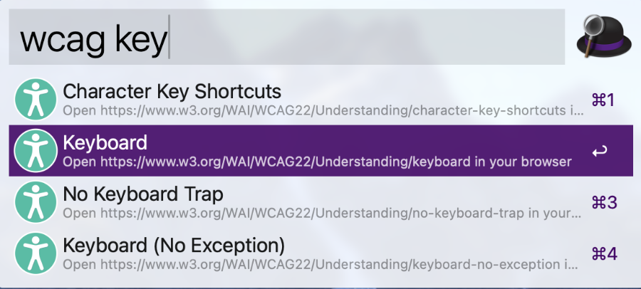

# WCAG2.2 Search Alfred Workflow

[](https://github.com/tricinel/wcag-search-alfred-workflow/actions/workflows/release.yaml)
[](https://github.com/tricinel/wcag-search-alfred-workflow/releases/latest)

Alfred workflow to search the Web Content Accessibility Guidelines (WCAG).



## Features

- Search the guidenlines of the WCAG2.2
- Open the selected guideline in your browser

## 📦 Installation

### Pre-packaged

Grab the latest release from [the releases page](https://github.com/tricinel/wcag-search-alfred-workflow/releases).

### Building from source

This workflow is written in Rust, so to install it from source you will first need to install Rust and Cargo. Next install [powerpack](https://github.com/rossmacarthur/powerpack). Then you can run the following to build an `.alfredworkflow` file.

```sh
git clone https://github.com/tricinel/wcag-search-alfred-workflow.git
cd wcag-search-alfred-workflow
powerpack package
```

The release will be available at `target/workflow/github.alfredworkflow`. You can link that to your Alfred folder with `powerpack link`.

## License

This project is distributed under the terms of the MIT license.
